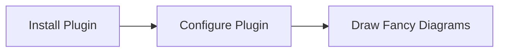

# gatsby-remark-mermaid

[](https://github.com/remcohaszing/gatsby-remark-mermaid/actions/workflows/ci.yaml)
[](https://www.npmjs.com/package/gatsby-remark-mermaid)
[](https://prettier.io)

Create [mermaid](https://mermaidjs.github.io/) graphs and diagrams in your markdown files.

This plugin uses [remark-mermaidjs](https://github.com/remcohaszing/remark-mermaidjs) to generate
SVG diagrams at build time. The mermaid code blocks are replaced with an inline SVG in the generated
HTML. This prevents any runtime dependencies on `mermaid.js`.

## Installation

```sh
npm install gatsby-remark-mermaid gatsby-transformer-remark
```

## Usage

Configure this plugin as a plugin of
[gatsby-transformer-remark](https://www.gatsbyjs.com/plugins/gatsby-transformer-remark/).

**NOTE:** Make sure you add this plugin **before** any other plugins that process code blocks.

Example configuration

```js
// In your gatsby-config.js
module.exports = {
  plugins: [
    {
      resolve: 'gatsby-transformer-remark',
      options: {
        plugins: [
          {
            resolve: `gatsby-remark-mermaid`,
            options: {
              launchOptions: {
                executablePath: 'path/to/chrome/executable'
              },
              svgo: {
                plugins: [{ name: 'removeTitle', active: false }]
              },
              mermaidOptions: {
                theme: 'neutral',
                themeCSS: '.node rect { fill: #fff; }'
              }
            }
          }
        ]
      }
    }
  ]
}
```

## Options

The configuration options for this plugin are the same as for
[`remark-mermaidjs`](https://github.com/remcohaszing/remark-mermaidjs#options).

- `launchOptions.executablePath`: String path to the chrome executable that puppeteer uses to render
  the mermaid diagrams to SVGs. (Required)
- `mermaidOptions`: Configuration object for customizing themes, styles, and properties of all
  mermaid diagrams. See
  [mermaidAPI configuration options](https://mermaid-js.github.io/mermaid/#/Setup). (Optional)
- `svgo`: Override default optimizations for the generated SVG files. Set to `false` to disable
  minifying using SVGO completely. See
  [defaultSVGOOptions](https://github.com/remcohaszing/remark-mermaidjs/blob/v4.0.0/index.ts#L18)).)
  (Optional)

**NOTE:** You can use the [Mermaid Live Editor](https://mermaidjs.github.io/mermaid-live-editor) to
preview the theme options described below.

## How it works

This plugin processes markdown code blocks set with `mermaid` as the language. It relies

For example, this mermaid code block:

````markdown

````

Generates the following SVG image:


## Credits

This package was originally developed by [Thomas Biesaart](https://github.com/ChappIO).

## License

[MIT](LICENSE.md) © [Thomas Biesaart](https://github.com/ChappIO)
